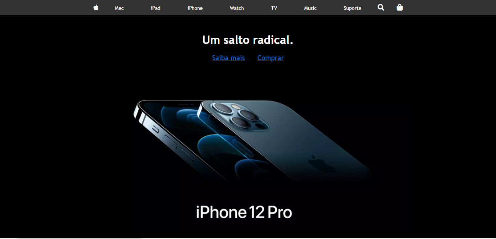
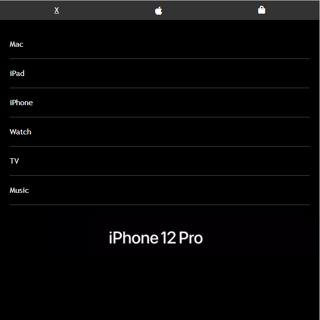

<h1 align="center">Apple Home</h1>
<h1 align="center"></h1>
<h1 align="center"></h1>

<hr>

### 📚 Sobre

Este é um simples clone de uma seção da página inicial do site da Apple. O clone foi realizado com o intuito de praticar o uso do menu responsivo.
O menu responsivo interage com o HTML e o CSS

### 🎨 Detalhe

Este clone foi feito junto com os tutoriais do canal Danki Code.

<hr>

### 🔥 Como contribuir

```
Fork este respositório
Faça as mudanças
Abra um pull request
```

### 💻 Tecnologias utilizadas

Neste aplicativo foram utilizadas as seguintes tecnologias:

- [HTML](https://www.w3schools.com/html/)
- [CSS](https://www.w3schools.com/css/)
- [JavaScript](https://www.w3schools.com/js/)

### ✈️ Como acessar o site

Hospedado no Netlify, acesse para vizualizar o menu responsivo

https://apple-gsj.netlify.app/

Ou então 

```
Faça o download do repositório e execute index.html
```
